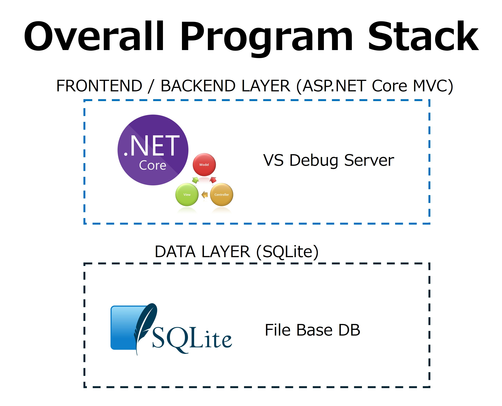
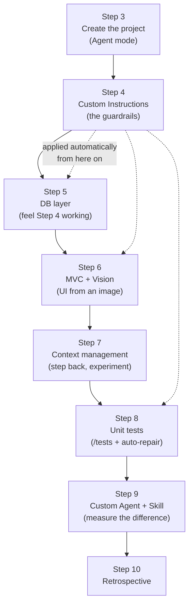

# Before Getting Started

🌐 **Language:** [日本語](README_JA.md) | **English**

[Previous - The Story of Making Mona's Dream Come True](../1_Story/README_EN.md) | [Next - Create the Project](../3_CreateProject/README_EN.md)

## The big picture of what you will build



> A full text description of this diagram is in [Image Analysis - Architecture Stacks](../ImageAnalysis/architecture-stacks.md).

1. Create an ASP.NET Core MVC (.NET 10) project and introduce SQLite
2. Implement the DB layer: entity, DbContext, seed data and so on
3. Implement the MVC application that connects to the database and exposes a web UI and REST API
4. Unit tests (xUnit)
5. Add a new feature with a Custom Agent

### How the steps fit together



*Diagram: Steps 3 through 10 run in sequence. Step 4 is the pivot — the Custom Instructions it creates are applied automatically to every step that follows, which is why Steps 5, 6 and 8 produce convention-following code without being told the conventions.*

### Approximate timing

Use this to pace a facilitated session. Times assume the environment is already installed.

| Step | Content | Time | Can it be skipped? |
|------|---------|------|--------------------|
| 1 | Story | 5 min | Yes, read it alone |
| 2 | This page | 10 min | No, contains prerequisites |
| 3 | Create the project | 15 min | No |
| 4 | Custom Instructions | 30 min | No, everything after depends on it |
| 5 | DB layer | 25 min | No |
| 6 | MVC + Vision | 40 min | The Vision exercise can fall back to text |
| 7 | Context management | 30 min | Yes, it is reflection rather than build |
| 8 | Unit tests | 25 min | Yes if time is short |
| 9 | Custom Agent + Skill | 45 min | No, this is the headline content |
| 10 | Retrospective | 15 min | No |

Total roughly **4 hours** including breaks. For a half-day session, drop Steps 7 and 8 and keep 9.


## Copilot features you will learn in this workshop

| Feature | Step where you learn it | Overview |
|---------|------------------------|----------|
| **Agent mode** | Step 3 onwards | Copilot runs terminal operations and file edits autonomously |
| **Custom Instructions** | Step 4 | `.github/copilot-instructions.md`, `.instructions.md` (applyTo), `.prompt.md` |
| **Vision (generating code from an image)** | Step 6 | Attach a wireframe image and implement the UI from it |
| **Token savings and context management** | Step 7 | Efficient use of `#file`, `#codebase` and similar |
| **The `/tests` command** | Step 8 | Generate tests automatically from existing code |
| **Custom Agent & Skill** | Step 9 | Create a project-specific agent with `.agent.md` + `SKILL.md` |

## About GitHub Copilot modes

This workshop mainly uses **Agent mode**.

| Mode | Characteristics | When to use it |
|------|-----------------|----------------|
| **Agent** | Edits files, runs the terminal and fixes errors autonomously | All implementation work (the main mode of this workshop) |
| **Ask** | Only answers questions. It proposes code but does not edit directly | Investigation, learning, design discussions |

### Notation used in this document

Every prompt step in this workshop carries one of the following badges to make clear **which mode to run it in**:

> 🕵️ **Agent mode** - files will change. Copilot generates, edits and builds code autonomously.

> 💬 **Ask mode** - no file changes. Used where you only observe and compare the output.

Check the badge before entering a prompt and switch to the correct mode first.

> **Tip:** In Agent mode you can review the terminal commands and file changes Copilot proposes before approving them. Make it a habit to always check the content.

### About the model to use

For this workshop we recommend setting the Copilot Chat model selector to **Auto**.

With Auto, Copilot picks an appropriate model based on the prompt and the work at hand. Available models differ depending on each participant's license and organisation settings, so the hands-on assumes Auto.

> **Tip:** When you implement across multiple files or fix tests in Agent mode, you may select the latest high-performance model available to you (for example the Claude Sonnet family or the GPT family). If you are unsure, stay on Auto.

## Context variables (the ones used in this workshop)

In Copilot Chat you can use the following variables inside a prompt to pass exactly the information that is needed:

| Variable | Purpose | Example |
|----------|---------|---------|
| `#file:path` | Add a specific file to the context | `Check the connection string by referring to #file:appsettings.json` |
| `#codebase` | Make the whole workspace searchable | `#codebase create a controller that fits this structure` |
| `#selection` | The code currently selected in the editor | When you want to ask about the selected range |
| `#terminalLastCommand` | The most recent terminal output | Right after an error appears: "fix this error" |

> **Note:** These are covered in detail in Step 7, "Token Savings and Context Management". For now it is enough to remember that they exist.

## Development environment and .NET version

This workshop uses **Visual Studio 2026 + .NET 10 (LTS)** as its primary environment.

| Environment | Recommended .NET version | Notes |
|-------------|--------------------------|-------|
| **Visual Studio 2026** | .NET 10 (LTS) | The main path of this workshop |
| **Visual Studio Code** (C# Dev Kit) | .NET 10 (LTS) | The workshop also runs on VS Code |
| **Visual Studio 2022** (v17.14.5 or later) | .NET 8 (LTS) | VS2022 does not support .NET 10 yet, so use .NET 8 |

> **For VS2022 + .NET 8 users:** wherever a prompt or command in a step says `.NET 10`, read it as `.NET 8`. The main technical differences are:
>
> | Item | .NET 10 | .NET 8 |
> |------|---------|--------|
> | Target framework moniker (TFM) | `net10.0` | `net8.0` |
> | EF Core package version | 10.x | 8.x |
> | `dotnet-ef` tool version | 10.x | 8.x |

## About the shell (command execution environment)

Commands in this workshop are written **assuming bash (shell)**.

- If you use PowerShell or Command Prompt, translate them into the equivalent commands
- If you are unsure how to translate, just ask Copilot Chat
  - Example: `Convert this bash command to PowerShell`

> **How to think about translation (same as .NET 10/8):** treat the bash form as the baseline and adapt commands to your own environment.

## Who this workshop is for

- People who have already touched the basics of Copilot (code completion and chat)
- People who want practical experience with the latest Copilot features such as Agent mode and Custom Instructions
- People interested in full-stack development with ASP.NET Core MVC + SQLite

## Prerequisites

### What you need

- A [GitHub Copilot](https://github.com/features/copilot/plans) license (Business or Enterprise)
- One of the following development environments:
  - **Recommended:** [Visual Studio 2026](https://visualstudio.microsoft.com/vs/) + [.NET 10 SDK](https://dotnet.microsoft.com/download/dotnet/10.0)
  - [VS Code](https://code.visualstudio.com/) ([C# Dev Kit extension](https://marketplace.visualstudio.com/items?itemName=ms-dotnettools.csdevkit)) + [.NET 10 SDK](https://dotnet.microsoft.com/download/dotnet/10.0)
  - **For VS2022 users:** [Visual Studio 2022](https://visualstudio.microsoft.com/vs/) v17.14.5 or later + [.NET 8 SDK](https://dotnet.microsoft.com/download/dotnet/8.0)
- **Agent mode** available in Copilot Chat
- The [dotnet-ef](https://learn.microsoft.com/ef/core/cli/dotnet) tool installed
- [Git CLI](https://git-scm.com/install/windows)

### Verify your environment before you start

Run these **before** the session, not during it. Every one of them has caused a workshop to stall.

#### 1. The .NET SDK

```bash
dotnet --version
```

Expected: `10.0.x` (or `8.0.x` if you are on VS2022).

```bash
dotnet --list-sdks
```

Expected: at least one line starting with `10.` or `8.`, for example:

```text
10.0.100 [C:\Program Files\dotnet\sdk]
```

> **If `dotnet` is not found:** the SDK is not installed, or its folder is not on your `PATH`. Reinstall from the link above and open a **new** terminal; an existing terminal will not pick up the new `PATH`.
>
> **If only an older SDK is listed:** installing a new SDK does not remove old ones. That is fine. `dotnet new` uses the newest by default unless a `global.json` pins it.

#### 2. The EF Core CLI tool

```bash
dotnet tool list --global
```

Expected: a row for `dotnet-ef`.

```text
Package Id      Version      Commands
---------------------------------------
dotnet-ef       10.0.0       dotnet-ef
```

If it is missing:

```bash
dotnet tool install --global dotnet-ef
```

If it is present but on the wrong major version:

```bash
dotnet tool update --global dotnet-ef
```

> **Why the major version matters:** the `dotnet-ef` major version must match your EF Core package major version. EF Core 10 packages with a version 8 tool produces an error that names neither, which is why this is worth checking up front. Step 5 covers it again if you hit it there.
>
> You can leave this one to the Agent if you prefer. Step 5 shows the Agent installing it on demand.

#### 3. Git

```bash
git --version
```

Expected: `git version 2.x.x`.

#### 4. Copilot Chat and Agent mode

This one is visual rather than a command:

1. Open your IDE
2. Open the Copilot Chat panel
   - **VS Code:** `Ctrl` + `Alt` + `I` (Windows/Linux), `Cmd` + `Ctrl` + `I` (macOS), or click the Copilot icon in the title bar
   - **Visual Studio 2026:** View > GitHub Copilot Chat
3. Find the mode dropdown at the bottom of the chat input box
4. Confirm that **Agent** is one of the options

> **If Agent is not listed:**
> - Update the GitHub Copilot Chat extension and restart the IDE. This fixes it most of the time
> - Confirm you are signed in to the account that holds the Copilot license (VS Code: the Accounts icon in the bottom left)
> - Agent mode may be disabled by an organisation policy. If you are on a Business or Enterprise plan, an administrator controls this under the organisation's Copilot policy settings
>
> More in the [Troubleshooting Guide](../TroubleshootingGuide/README_EN.md).

#### 5. Your Copilot license is active

In Copilot Chat, send any short question. If you get an answer, the license is active. If you get an authentication error, sign out and back in.

### Pre-session checklist

Everything below should be true before Step 3.

- [ ] `dotnet --version` prints 10.x (or 8.x on VS2022)
- [ ] `dotnet tool list --global` shows `dotnet-ef`, or you accept letting the Agent install it
- [ ] `git --version` prints a version
- [ ] The Copilot Chat panel opens
- [ ] **Agent** appears in the mode dropdown
- [ ] A test question in Copilot Chat returns an answer
- [ ] You have cloned this repository and can see the `docs/` folder

## Expected outcomes

By the end of this workshop you will be able to:
- Build an application efficiently using Copilot Agent mode
- Reflect your team's conventions in Copilot through Custom Instructions and Custom Agents
- Write efficient prompts that do not waste tokens
- Use the latest Copilot features such as generating UI from an image

## Recommended folder layout

### The whole repository (initial state)

Straight after cloning, the repository contains only the hands-on material (`docs/`) and the README:

```text
copilot-custom-workshop-dotnet-web/    <- repository root
├── README.md
└── docs/                              <- hands-on instructions (for reference)
```

### When the workshop is complete

As you work through the steps, the application and the Copilot customisation files are created inside the `app/` folder. **The `app/` folder is the workspace you open in the IDE.**

```text
app/                           <- workspace root (the folder you open in the IDE)
├── .github/                   <- Custom Instructions and Custom Agent definitions
│   ├── copilot-instructions.md
│   ├── instructions/            <- file-scope instructions
│   ├── prompts/                 <- reusable prompts
│   ├── agents/                  <- custom agents
│   └── skills/                  <- skills
├── MeowWorld/                 <- the ASP.NET Core MVC application
├── MeowWorld.Tests/           <- the xUnit test project
├── MeowWorld.slnx             <- the solution file
└── docs/                      <- project documentation (architecture-guide and so on)
```

> **Note:** Because `.github/` sits directly under the workspace root, VS Code and Visual Studio detect the Copilot Custom Instructions automatically.

[Previous - The Story of Making Mona's Dream Come True](../1_Story/README_EN.md) | [Next - Create the Project](../3_CreateProject/README_EN.md)
