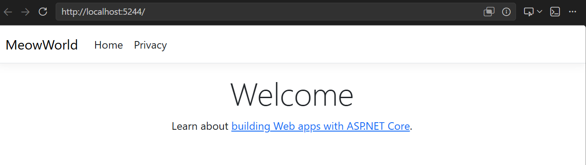

# Create the Project (Agent mode)

🌐 **Language:** [日本語](README_JA.md) | **English**

[Previous - Before Getting Started](../2_BeforeGettingStarted/README_EN.md) | [Next - Custom Instructions](../4_CustomInstructions/README_EN.md)

In this step you use GitHub Copilot's Agent mode to go all the way from creating an ASP.NET Core MVC project, through introducing the SQLite packages, to confirming that it builds.

> **Time:** about 15 minutes
> **You will end with:** a `MeowWorld` MVC project that builds and serves the default page, with three EF Core SQLite packages installed
> **New Copilot skill:** running Agent mode end to end and approving its terminal commands


---

## Set up the project in Agent mode

### Prerequisites

- The .NET 10 SDK is installed
- Visual Studio 2026 or VS Code (C# Dev Kit) is installed
- "Agent" can be selected in the Copilot Chat mode switcher

### Procedure

1. Create an `app` folder at the repository root and **open the `app/` folder in your IDE as the workspace**.
   - **VS Code:** `File > Open Folder` -> select the `app` folder
   - **Visual Studio 2026:** "Open a local folder" -> select the `app` folder

   ```bash
   mkdir app
   ```

   > **Why make `app/` the workspace?**
   > - In real development, **project root = workspace root** is the standard
   > - The hands-on material (`docs/`) does not leak into Copilot's context, so completion accuracy improves
   > - `.github/copilot-instructions.md` ends up in its natural position directly under the workspace root
   > - Every file path you create in later steps matches the form used in real work

2. Open Copilot Chat and select **"Agent"** from the mode dropdown

3. Enter and send the following prompt:

> 🕵️ **Agent mode**

**Original (Japanese):**

```
.NET 10 の ASP.NET Core MVC プロジェクト "MeowWorld" を新規作成してください。
SQLite 関連の NuGet パッケージ（Microsoft.EntityFrameworkCore.Sqlite、
Microsoft.EntityFrameworkCore.Design、Microsoft.EntityFrameworkCore.Tools）を追加し、
ビルドが通ることを確認してください。
```

**English equivalent:**

```
Create a new .NET 10 ASP.NET Core MVC project named "MeowWorld".
Add the SQLite-related NuGet packages (Microsoft.EntityFrameworkCore.Sqlite,
Microsoft.EntityFrameworkCore.Design, Microsoft.EntityFrameworkCore.Tools)
and confirm that the build passes.
```

4. When the Agent asks for permission to run a terminal command, **check the content** and press "Continue"

5. The Agent runs the following in order:
   - `dotnet new mvc` to create the project
   - `dotnet add package` to add the NuGet packages
   - `dotnet build` to confirm the build

> **Tip:** If an error occurs while the Agent is running, the Agent automatically analyses it and tries to fix it. This is one of the big advantages of Agent mode.

### Reading the Agent's output as it works

You are not just waiting here. Watch for four things, because they are what distinguishes Agent mode from Ask mode:

| What you will see | What it means |
|-------------------|---------------|
| A terminal command with a **Continue / Cancel** prompt | The Agent will not run anything without your approval. Read the command before approving |
| A file tree appearing in the chat | The Agent is reporting what it created, not asking |
| A build error followed by more activity | The Agent caught the error itself and is fixing it. Do not intervene yet |
| A final summary | The Agent believes it is done |

> **How long should approval take?** Read each command. `dotnet new mvc -n MeowWorld` and `dotnet add package` are safe and expected. If you see a command that deletes files, touches anything outside `app/`, or installs something you did not ask for, cancel and ask the Agent why it wants to run it. That habit matters far more in a real repository than it does here.

### Verification

Once the build succeeds, confirm that the application starts.

**1. Check the expected file layout.** From the workspace root (`app/`):

```bash
ls MeowWorld
```

Expected, roughly:

```text
Controllers/  Models/  Views/  wwwroot/  Properties/
appsettings.json  appsettings.Development.json
MeowWorld.csproj  Program.cs  obj/  bin/
```

**2. Confirm the packages actually landed:**

```bash
cd MeowWorld
dotnet list package
```

Expected: all three SQLite/EF Core packages, on matching major versions.

```text
Project 'MeowWorld' has the following package references
   [net10.0]:
   Top-level Package                                Requested   Resolved
   > Microsoft.EntityFrameworkCore.Design           10.0.0      10.0.0
   > Microsoft.EntityFrameworkCore.Sqlite           10.0.0      10.0.0
   > Microsoft.EntityFrameworkCore.Tools            10.0.0      10.0.0
```

> **If the major versions differ from each other** (say a 9.x mixed with 10.x), fix it now rather than in Step 5. Mismatched EF Core packages fail at migration time with an error that does not mention versions. Ask the Agent: `Align all EF Core package versions to the latest 10.x and rebuild.`

**3. Run it:**

```bash
dotnet run
```

Expected output, with your own port numbers:

```text
Building...
info: Microsoft.Hosting.Lifetime[14]
      Now listening on: http://localhost:5244
info: Microsoft.Hosting.Lifetime[0]
      Application started. Press Ctrl+C to shut down.
info: Microsoft.Hosting.Lifetime[0]
      Hosting environment: Development
```

Open the `Now listening on` URL. If a browser opened by itself, use that.

If the default ASP.NET Core page appears, you have succeeded.



> A full text description of this screenshot is in [Image Analysis - Initial Web App](../ImageAnalysis/init-webapp.md).

**4. Stop it.** Press `Ctrl` + `C` in the terminal. Leaving it running will lock the SQLite file in Step 5 and hold the port.

---

### When it does not work

| Symptom | Likely cause | Fix |
|---------|--------------|-----|
| `dotnet: command not found` | SDK missing or not on `PATH` | See the environment verification in [Step 2](../2_BeforeGettingStarted/README_EN.md) |
| `MSB1003: Specify a project or solution file` | You are in `app/`, not `app/MeowWorld/` | `cd MeowWorld` first |
| `Address already in use` | A previous `dotnet run` is still alive | Stop it, or let the Agent pick another port |
| Browser shows a certificate warning | You opened the HTTPS URL and the dev cert is not trusted | `dotnet dev-certs https --trust`, or just use the HTTP URL |
| The page loads but the navbar does not say `MeowWorld` | The project was created with a different name | Check `MeowWorld.csproj` exists; if not, the Agent named it something else |
| The Agent created the project one level too deep (`app/MeowWorld/MeowWorld/`) | It ran `dotnet new` from inside a folder it had just created | Tell it: `The project is nested one level too deep. Move it so the csproj is at app/MeowWorld/MeowWorld.csproj` |

The last row is the most common Agent-specific mistake in this step. It is worth watching for, because every path in the later steps assumes `app/MeowWorld/`.

### Step 3 completion checklist

- [ ] `app/MeowWorld/MeowWorld.csproj` exists
- [ ] `dotnet list package` shows all three EF Core packages on matching majors
- [ ] `dotnet build` succeeds with no errors
- [ ] `dotnet run` serves a page whose navbar reads **MeowWorld**
- [ ] You stopped the process with `Ctrl` + `C`

---

## Learning point: the characteristics of Agent mode

Let us review the characteristics of Agent mode that you experienced in this step:

| Characteristic | What you experienced in this step |
|----------------|-----------------------------------|
| **Autonomous task execution** | One prompt completed everything from project creation to build verification |
| **Terminal operation** | The Agent ran the `dotnet` commands directly |
| **Automatic error recovery** | When a build error appears, the cause is analysed and fixed automatically |
| **Confirmation-based progress** | User approval is requested before each command runs |

> **Difference from Ask mode:** Ask mode only tells you "the steps for the commands"; you have to run them yourself. In Agent mode, Copilot handles the execution as well.

---

## Appendix: setting up manually

If you want to proceed manually without Agent mode, run the following commands in order:

<details>
<summary>Manual setup procedure (click to expand)</summary>

```bash
# Run with the app/ folder opened as the workspace

# 1. Create the project
dotnet new mvc -n MeowWorld

# 2. Add the NuGet packages
cd MeowWorld
dotnet add package Microsoft.EntityFrameworkCore.Sqlite
dotnet add package Microsoft.EntityFrameworkCore.Design
dotnet add package Microsoft.EntityFrameworkCore.Tools

# 3. Confirm the build
dotnet build
```

</details>

---

[Previous - Before Getting Started](../2_BeforeGettingStarted/README_EN.md) | [Next - Custom Instructions](../4_CustomInstructions/README_EN.md)
