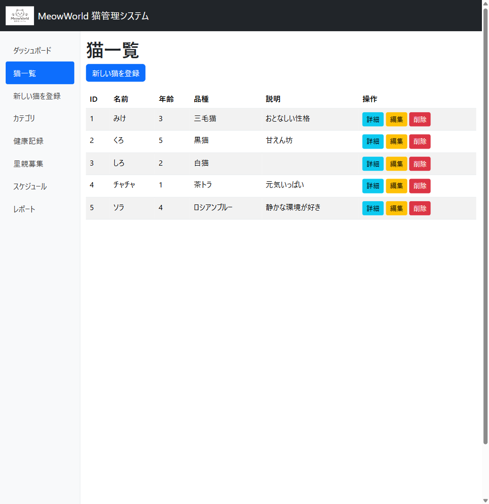

# Implement MVC + Vision

🌐 **Language:** [日本語](README_JA.md) | **English**

[Previous - Implement the DB Layer](../5_ImplementDBLayer/README_EN.md) | [Next - Token Savings and Context Management](../7_TokenManagement/README_EN.md)

In this step you implement the controller and the views. You then use Copilot's **Vision feature** (image recognition) to generate UI from a wireframe image.

---

## 1. Generate the CRUD controller (using .prompt.md)

Use the reusable prompt you created in Step 4.

> 🕵️ **Agent mode** - type `/` and select `create-crud-controller`

**Original (Japanese):**

```
/create-crud-controller Cat エンティティ（Id, Name, Age, Breed, Description, CreatedAt）
```

**English equivalent:**

```
/create-crud-controller the Cat entity (Id, Name, Age, Breed, Description, CreatedAt)
```

> **Key point:** using `.prompt.md` makes the structure of your CRUD controllers consistent every time. You can reuse the same prompt when you add another entity.

### Let the Agent handle the rest

Once the controller is generated, give the follow-up instruction:

> 🕵️ **Agent mode**

**Original (Japanese):**

```
CatsController の全ビュー（Index, Details, Create, Edit, Delete）も作成して、
ナビゲーションメニューに「猫一覧」リンクを追加してください。
ビルドと動作確認もお願いします。
```

**English equivalent:**

```
Also create all the views for CatsController (Index, Details, Create, Edit, Delete)
and add a "猫一覧" (cat list) link to the navigation menu.
Please build and verify it works as well.
```

---

## 2. Implementing UI with Vision

### What the Vision feature is

Copilot can **take an image as input**, understand its contents and generate code. Hand it a design comp or a wireframe and it implements the corresponding HTML/CSS for you.

### Preparing the logo image

The wireframe includes a cat logo in the header, but **GitHub Copilot is a code generation tool and cannot generate image files**. You have to provide the logo image separately.

#### Option A: generate it with M365 Copilot (Microsoft Designer) (recommended)

Generate an image at [Microsoft Designer](https://designer.microsoft.com/) with a prompt such as:

**Original (Japanese):**

```
シンプルでかわいい猫のロゴを作成してください。
```

**English equivalent:**

```
Create a simple, cute cat logo.
```

Save the generated image as `wwwroot/images/logo.png`.

> **Key point:** GitHub Copilot handles code generation and M365 Copilot handles image generation. This is a practical workflow that combines the Microsoft Copilot ecosystem.

#### Option B: use the logo bundled with the repository

This repository includes a pre-generated logo. Copy it from the terminal in the workspace (`app/`):

```bash
mkdir -p MeowWorld/wwwroot/images
cp ../docs/assets/logo.png MeowWorld/wwwroot/images/logo.png
```

> **Note:** `../docs/assets/` points at `docs/assets/` inside the cloned repository (one level above the workspace).

#### Option C: substitute an icon font or emoji

- **Bootstrap Icons:** use an icon font such as `<i class="bi bi-emoji-smile"></i>`
- **emoji:** place `🐱` directly in the header

Either option is fine for the exercises that follow.

---

### Exercise: re-implement the view from the wireframe

1. Switch Copilot Chat to Agent mode

2. Click the **paperclip icon (📎)** in the chat input box and attach the following image:
   - `docs/assets/Designer.png` inside the cloned repository (one level above the workspace -> `docs/assets/`)

   > **If you cannot find the image:** look for `copilot-custom-workshop-dotnet-web/docs/assets/Designer.png` in your file explorer. Ask your instructor, or use the "text-based alternative" below.

3. Enter the following prompt:

> 🕵️ **Agent mode** + 🖼️ **Vision (image attached)**

**Original (Japanese):**

```
添付したワイヤーフレームを参考に、Views/Cats/Index.cshtml を
このデザインに近づけてください。左サイドバーのナビゲーションは
_Layout.cshtml に実装してください。
ヘッダーのロゴには wwwroot/images/logo.png を使用してください。
```

**English equivalent:**

```
Using the attached wireframe as a reference, bring Views/Cats/Index.cshtml
closer to this design. Implement the left sidebar navigation in
_Layout.cshtml.
Use wwwroot/images/logo.png for the header logo.
```

4. Copilot analyses the image, recognises the following and implements it:
   - The title in the header area
   - The navigation structure of the left sidebar
   - The cat list table in the main content
   - The action buttons (details, edit, delete)

### What to check

| Element in the image | Expected implementation |
|----------------------|-------------------------|
| Left sidebar | A Bootstrap sidebar navigation in `_Layout.cshtml` |
| Cat list table | `<table class="table">` with `asp-action` tag helpers |
| Action buttons | Details / Edit / Delete link buttons |
| Responsive | Bootstrap `container-fluid` + `row` + `col` |

> **Learning point:** using Vision dramatically streamlines the "implement the screen the designer made" workflow. You no longer have to describe the layout in fine detail in the prompt.

> **A full text description of the wireframe**, including every label, the table contents and an English/Japanese label mapping, is in [Image Analysis - Designer Wireframe](../ImageAnalysis/designer-wireframe.md). It is worth reading even if Vision works for you, because it tells you exactly what the model was supposed to see.

---

### Text-based alternative (for VS2022 or when you have no image)

If the Vision feature is unavailable or you have no image, the following prompt implements an equivalent UI:

<details>
<summary>Text-based prompt (click to expand)</summary>

> 🕵️ **Agent mode**

**Original (Japanese):**

```
Views/Cats/Index.cshtml と _Layout.cshtml を以下の仕様で実装してください：

【_Layout.cshtml】
- ヘッダー: "MeowWorld 猫管理システム" のタイトル
- 左サイドバーナビゲーション:
  - ダッシュボード
  - 猫一覧（アクティブ）
  - 新しい猫を登録
  - カテゴリ
  - 健康記録
  - 里親募集
  - スケジュール
  - レポート
  - ユーザー管理
  - 設定
- メインコンテンツ: @RenderBody()
- Bootstrap 5 のダッシュボード風レイアウト

【Views/Cats/Index.cshtml】
- テーブルに猫一覧を表示（ID, 名前, 年齢, 品種）
- 各行に「詳細」「編集」「削除」ボタン
- 「新しい猫を登録」ボタン（テーブル上部）
```

**English equivalent:**

```
Implement Views/Cats/Index.cshtml and _Layout.cshtml to the following specification:

[_Layout.cshtml]
- Header: the title "MeowWorld 猫管理システム" (MeowWorld Cat Management System)
- Left sidebar navigation:
  - ダッシュボード (Dashboard)
  - 猫一覧 (Cat list) (active)
  - 新しい猫を登録 (Register a new cat)
  - カテゴリ (Categories)
  - 健康記録 (Health records)
  - 里親募集 (Adoption)
  - スケジュール (Schedule)
  - レポート (Reports)
  - ユーザー管理 (User management)
  - 設定 (Settings)
- Main content: @RenderBody()
- A Bootstrap 5 dashboard-style layout

[Views/Cats/Index.cshtml]
- Display the cat list in a table (ID, name, age, breed)
- "詳細" (Details), "編集" (Edit) and "削除" (Delete) buttons on each row
- A "新しい猫を登録" (Register a new cat) button above the table
```

> Keep the Japanese labels if you want the workshop's intended result. If you prefer an English or bilingual UI, implement the toggle from [docs/Localization/README.md](../Localization/README.md) rather than hard-coding English labels here; the sidebar keys are already listed in the [string catalog](../Localization/string-catalog.md).

</details>

---

## 3. Verify the behaviour

```bash
cd MeowWorld
dotnet run
```

Check the display in the browser and confirm the following work:

### What the finished screen looks like



> A full text description of this screenshot is in [Image Analysis - Cats Index Screenshot](../ImageAnalysis/cats-index-screenshot.md).

- [ ] The cat list is displayed in table form
- [ ] The 5 seed records are displayed
- [ ] You can add a cat with Create
- [ ] You can change a cat's information with Edit
- [ ] You can delete a cat with Delete
- [ ] You can check a cat's information with Details

---

## Summary

The Copilot features you experienced in this step:

| Feature | What you experienced |
|---------|----------------------|
| `.prompt.md` | Consistent CRUD generation through a reusable prompt |
| **Vision** | Automatic UI implementation from a wireframe image |
| Agent mode | Controller + views + build verification end to end |
| `.instructions.md` | `applyTo: "**/*.cshtml"` applied Bootstrap 5 + Japanese automatically |

---

[Previous - Implement the DB Layer](../5_ImplementDBLayer/README_EN.md) | [Next - Token Savings and Context Management](../7_TokenManagement/README_EN.md)
