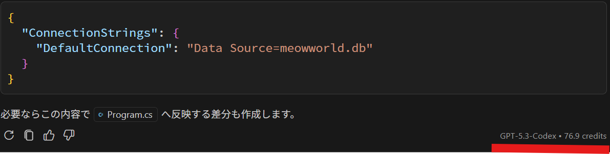
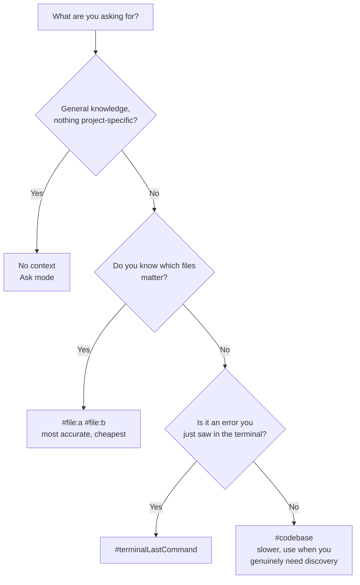

# Token Savings and Context Management

🌐 **Language:** [日本語](README_JA.md) | **English**

[Previous - Implement MVC + Vision](../6_ImplementMVC/README_EN.md) | [Next - Unit Testing](../8_UnitTesting/README_EN.md)

Whether Copilot returns accurate output depends heavily on **what context you pass it**. In this step you use the code you implemented in Steps 5 and 6 as material to learn how to manage context efficiently and get high-quality output while saving tokens.

> **A step for reflection:** in Steps 5 and 6 you implemented everything at speed in Agent mode. In this step you take a step back and experience "how to write better prompts" through experiments.

> **Time:** about 30 minutes
> **You will end with:** no code changes at all, and a measured sense of what context actually buys you
> **New Copilot skills:** `#file`, `#codebase`, `#terminalLastCommand`
>
> **This step changes no files.** Everything runs in Ask mode. If your session is running short, this is the safest step to cut.


---

## Why context management matters

| Problem | Cause | Result |
|---------|-------|--------|
| The output misses the point | Necessary information is missing | Proposals that contradict the existing code -> rework |
| The response is slow | A large amount of unnecessary information is sent | Search and inference take time |
| A chain of rework | Ambiguous instructions | You send correction prompt after correction prompt, and cumulative cost grows |
| Output is cut off midway | The context window limit is exceeded | Incomplete code generation |

**Goal:** pass only the information that is necessary and sufficient, and get **accurate output in one shot**. That saves both time and credits in the end.

---

## Comparison experiment: how the way you pass context changes the output

Ask the same question in the three patterns below and feel the difference.

> **❗ Run this experiment in Ask mode.** Agent mode would modify files, so Ask mode is the right choice when the aim is to observe and compare output.

> **❗ Open a new chat session for each pattern.** If you keep asking in the same session, the previous answer stays in the context and the comparison is no longer clean. Open a new session with the "+" button at the top of the Chat panel.

### The experiment prompt

"Create an extension method that seeds 5 initial cat records into `AppDbContext`"

The accuracy of the code for this question changes a lot depending on whether the model can correctly reference the `AppDbContext` and `Cat` entity implementations you created in Step 5.

---

### Pattern A: no context

Open a **new chat session** and enter the following:

> 💬 **Ask mode**

**Original (Japanese):**

```
AppDbContext に猫の初期データ 5 件をシード投入する拡張メソッドを作成して
```

**English equivalent:**

```
Create an extension method that seeds 5 initial cat records into AppDbContext
```

**Problems you can expect:**
- The model does not know the property layout of `AppDbContext` or `Cat`, so it guesses
- Namespaces and class names come out inaccurate
- It may use properties that do not exist on `Cat` (for example `Color`)

---

### Pattern B: pass the whole thing with `#codebase`

Open a **new chat session** and enter the following:

> 💬 **Ask mode**

**Original (Japanese):**

```
#codebase AppDbContext に猫の初期データ 5 件をシード投入する拡張メソッドを作成して
```

**English equivalent:**

```
#codebase Create an extension method that seeds 5 initial cat records into AppDbContext
```

**Characteristics:**
- Copilot searches the whole workspace and finds `AppDbContext` and `Cat`
- You tend to get accurate output, but the search and processing take time
- On a large project, token consumption is high

---

### Pattern C: pinpoint it with `#file`

Open a **new chat session** and enter the following:

> 💬 **Ask mode**

**Original (Japanese):**

```
#file:MeowWorld/Data/AppDbContext.cs と #file:MeowWorld/Models/Cat.cs を参照して、
AppDbContext に猫の初期データ 5 件をシード投入する拡張メソッドを作成して
```

**English equivalent:**

```
Referring to #file:MeowWorld/Data/AppDbContext.cs and #file:MeowWorld/Models/Cat.cs,
create an extension method that seeds 5 initial cat records into AppDbContext
```

**Characteristics:**
- You pass only the files that are needed, explicitly
- It references the real property definitions of `Cat`, so it is the most accurate
- Token consumption is minimal

---

### Comparison of the results

| Aspect | A: none | B: #codebase | C: #file |
|--------|---------|--------------|----------|
| Accuracy of the output | △ a lot of guessing | ○ accurate | ◎ the most accurate |
| Response speed | ○ fast but rework is likely | △ the search takes time | ◎ fast with no rework |
| AI credits | depends on the situation※ | △ tends to be high | ○ tends to be low |
| Where it fits | General questions | When you need to grasp the overall structure | Operating on specific files |

> ※ For a small one-off task the credit difference can come out small. The difference becomes pronounced on large tasks spanning multiple files, or when working continuously in Agent mode.

### Experiment worksheet

Fill this in as you go. Comparing from memory after all three runs does not work; the outputs blur together.

```text
                        │ A: none    │ B: #codebase │ C: #file
────────────────────────┼────────────┼──────────────┼───────────
Model shown in footer   │            │              │
Credits shown in footer │            │              │
Time to first token     │  fast/slow │  fast/slow   │  fast/slow
Used only real Cat      │   Y / N    │    Y / N     │   Y / N
  properties?           │            │              │
Invented a property?    │  which:    │   which:     │   which:
Correct namespace       │   Y / N    │    Y / N     │   Y / N
  (MeowWorld.Data)?     │            │              │
Japanese comments?      │   Y / N    │    Y / N     │   Y / N
async/await used?       │   Y / N    │    Y / N     │   Y / N
Would you ship it       │   Y / N    │    Y / N     │   Y / N
  without edits?        │            │              │
```

The bottom row is the one that matters. Credits are a proxy; "would I have to fix this" is the actual cost.

### What to observe in the output

When you compare the three outputs side by side, pay attention to:

1. **Accuracy of the properties** - does it correctly use the real properties of `Cat` (`Name`, `Age`, `Breed`, `Description`)? Pattern A may use properties that do not exist (for example `Color`)
2. **Accuracy of the namespace** - does it reference `MeowWorld.Data` correctly?
3. **Reflection of project conventions** - are the "Japanese comments", "async/await" and "LINQ method syntax" specified in the Custom Instructions reflected?

### Checking AI credits and response quality

After trying each pattern, check the **model name** and the **credit consumption** shown at the bottom right of the chat panel.



> A full text description of this screenshot, including the Japanese sentence in it, is in [Image Analysis - AI Credit Check](../ImageAnalysis/check-aicredit.md).

#### Why the credits differ

AI credit consumption is decided by a combination of the following factors:

| Factor | Effect |
|--------|--------|
| **The model used** | In Auto mode the model is selected automatically according to the complexity of the input. Clear prompts tend to be handled by lighter models |
| **Input token volume** | `#codebase` sends the whole search result, so the input is large |
| **Output token volume** | When context is missing, speculative explanations of assumptions increase and the output gets longer |
| **Depth of reasoning** | Ambiguous instructions spend the model's reasoning resources on deciding "what should I even generate" |

> **The important lesson:** the benefit of a good prompt shows up not in the tiny per-call credit difference but in **reduced rework** and **cumulative savings**. Getting accurate output in one shot saves considerably more total credits and time than generating with a vague instruction and then correcting repeatedly.

---

## Best practices

### 1. Specify only the files you need with `#file`

```
❌ With the context of the whole project, create a CRUD controller

✅ Referring to #file:MeowWorld/Models/Cat.cs and #file:MeowWorld/Data/AppDbContext.cs,
   create a CRUD controller for Cat
```

### 2. Let Custom Instructions carry the implicit context

Thanks to the `.github/copilot-instructions.md` you configured in Step 4, you no longer have to write the following every time:

```
❌ In C#, using a file-scoped namespace, with Japanese comments, using async/await...

✅ Create a CRUD controller for Cat
   (the Custom Instructions apply automatically, so writing the conventions is unnecessary)
```

### 3. Keep prompts concise and the intent clear

```
❌ In a .NET 10 ASP.NET Core MVC project, using Entity Framework Core,
   connecting to a SQLite database, please create a controller for a web application
   that manages cat information. The controller should include list display, detail
   display, create, edit and delete features.

✅ Create a CRUD controller for Cat. Make every action async.
   (the project information is in the Custom Instructions. Write only the necessary instructions)
```

### 4. Make the most of Agent mode autonomy

In Agent mode you can complete several operations with a single instruction:

```
❌ (asking in three separate turns)
   1. Create a CRUD controller for Cat
   2. Create the matching views too
   3. Configure the routing as well

✅ (done in one turn)
   Implement the CRUD feature for Cat (controller + views + routing configuration).
   Also run the build to verify it works.
```

### 5. Use `#terminalLastCommand` when an error occurs

When an error appears in the terminal:

```
❌ (copying and pasting the error message)
   I got the following error:
   error CS0246: The type or namespace name 'AppDbContext'...

✅ #terminalLastCommand fix this error
```

---

## Choosing a context strategy



*Diagram: a decision tree. General questions need no context. When you know the relevant files, name them with `#file`, which is both the most accurate and the cheapest option. Use `#terminalLastCommand` for a fresh error, and fall back to `#codebase` only when you actually need Copilot to discover which files matter.*

> **The practical rule:** `#codebase` is for discovery, not for accuracy. Once you know the answer to "which files matter", switching to `#file` is strictly better on every axis. People reach for `#codebase` out of habit because it feels thorough; it is mostly paying for a search you could have skipped.

## Cheat sheet: which to use when

| What you want to do | Recommended context specification |
|---------------------|-----------------------------------|
| Modify a specific file | `#file:the target file` |
| Create something new matching the existing code | Specify several `#file:` references worth following |
| Design with the project structure in mind | `#codebase` |
| Fix an error | `#terminalLastCommand`, or leave it to the Agent |
| Ask about general knowledge | No context (Ask mode recommended) |

---

## Exercise

Run the following question with pattern C (`#file` specified) and confirm that an accurate result comes back:

> 💬 **Ask mode**

**Original (Japanese):**

```
#file:MeowWorld/Data/AppDbContext.cs と #file:MeowWorld/Models/Cat.cs を参照して、
Cat エンティティに「ワクチン接種記録」プロパティ（VaccinatedAt: DateTime?）を追加するための
マイグレーションとモデル変更のコードを書いて。
```

**English equivalent:**

```
Referring to #file:MeowWorld/Data/AppDbContext.cs and #file:MeowWorld/Models/Cat.cs,
write the migration and model-change code to add a "vaccination record" property
(VaccinatedAt: DateTime?) to the Cat entity.
```

> **Note:** Ask mode does not change files. The aim here is to observe that "specifying `#file` produces accurate output". You will experience the real feature addition in Step 9 (Custom Agent).

### Step 7 completion checklist

- [ ] You ran all three patterns, each in its own new chat session
- [ ] You filled in the worksheet while the outputs were in front of you
- [ ] You found at least one difference in correctness, not just in speed
- [ ] You located the model name and credit figure in the chat footer
- [ ] **No files were changed** — confirm with `git status` if your `app/` is a repo, or just check that no editor tabs show unsaved changes

> **If all three patterns produced equally good output**, that is a real result, not a failed experiment. It usually means the task was small enough that the model could infer the shape of `Cat` correctly from its name alone. Try again with something genuinely project-specific, such as `Cat の CreatedAt を使って「今月登録された猫」を返すメソッドを書いて` ("write a method that returns cats registered this month, using Cat.CreatedAt"), where guessing the property name is much harder.

---

[Previous - Implement MVC + Vision](../6_ImplementMVC/README_EN.md) | [Next - Unit Testing](../8_UnitTesting/README_EN.md)
