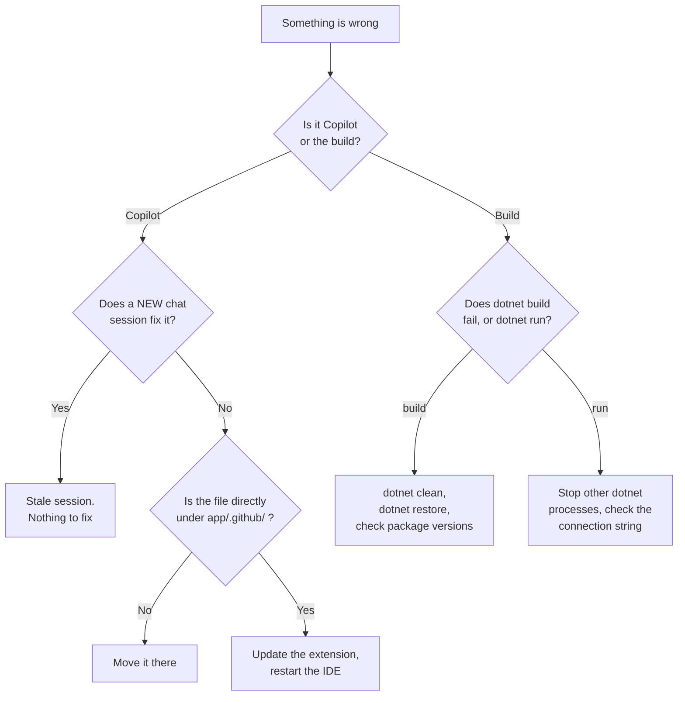

# Troubleshooting Guide

🌐 **Language:** [日本語](README_JA.md) | **English**

## Start here: the four fixes that solve most problems

Before reading further, try these in order. Between them they resolve the large majority of workshop problems.

| # | Fix | Solves |
|---|-----|--------|
| 1 | **Open a new chat session** | Instructions, agents or skills not taking effect after you created or edited them |
| 2 | **Confirm you are in the right folder** — `app/` is the workspace, `app/MeowWorld/` is where `dotnet` commands run | "Project not found", prompts not listed, instructions ignored |
| 3 | **Update the Copilot Chat extension and restart the IDE** | Agent mode missing, `/tests` or `/fix` unavailable, attachment button missing |
| 4 | **Stop every running `dotnet` process** | Locked database, port in use, stale build output |

A quick way to confirm #2:

```bash
pwd          # should end in /app or /app/MeowWorld
ls           # from app/: you should see .github and MeowWorld
```

## Diagnosing by symptom



*Diagram: a triage tree. Copilot problems are almost always either a stale chat session or a file in the wrong folder; build problems are almost always either package versions or a process still holding a file or port.*

---

## Copilot issues

### I cannot select Agent mode
- Check that your Copilot Chat version is up to date
- On VS Code: update the "GitHub Copilot Chat" extension to the latest version
- On VS 2026: check for updates under Tools > Manage Extensions

### Custom Instructions are not being applied
- **VS Code:** check that `github.copilot.chat.codeGeneration.useInstructionFiles` is set to `true` in settings
- Check that the path of `.github/copilot-instructions.md` is correct (inside the `.github/` folder directly under the workspace root)
- Try again after opening a **new chat session** (an existing session may not pick it up)

### The `applyTo` in `.instructions.md` has no effect
- Check that the glob pattern is correct (for example `**/*.cshtml`, `**/*.Tests/**`)
- Check that the file is inside the workspace
- Check that you are **operating on the matching file as an edit target** (just viewing it does not apply the rules)

### The Custom Agent (`@agentname`) does not appear
- Check that a `.agent.md` file exists in the `.github/agents/` directory
- Check for syntax errors in the YAML front matter (the part enclosed by `---`)
- Try restarting Copilot Chat

### `/tests` or `/fix` does not work
- Check that the target file is open in the editor
- Check that the Copilot Chat extension is up to date

---

## Development environment issues

### The SQLite file is locked / inaccessible
- Check that you do not have several instances of the application running
- If you want to delete the DB file (`meowworld.db`) and recreate it, stop the application completely first

### An error appears during migration
- Check that the `dotnet-ef` tool is installed: `dotnet tool list --global`
- If it is not installed: `dotnet tool install --global dotnet-ef`
- Check that the package versions and the target framework match (.NET 10 -> EF Core 10.x, .NET 8 -> EF Core 8.x)

### Build errors

Work through these in order:

```bash
dotnet clean
dotnet restore
dotnet build
```

If it still fails, check the specifics:

- Check `<TargetFramework>` in the `.csproj` (`net10.0` or `net8.0`)
- Check that the EF Core package versions are consistent with each other **and** with the target framework:

  ```bash
  dotnet list package
  ```

  All three EF Core packages should share a major version, and that major should match your .NET version. .NET 10 takes EF Core 10.x; .NET 8 takes 8.x.

- `error NETSDK1045: The current .NET SDK does not support targeting .NET 10.0` means your SDK is older than the project. Either install the .NET 10 SDK or retarget to `net8.0`.

### The project was created in the wrong place

If `MeowWorld.csproj` is not at `app/MeowWorld/MeowWorld.csproj`, every path in the workshop will be off by a level. This happens when the Agent runs `dotnet new` from inside a folder it just created.

```bash
find . -name "*.csproj" -not -path "*/obj/*"
```

Expected from `app/`:

```text
./MeowWorld/MeowWorld.csproj
./MeowWorld.Tests/MeowWorld.Tests.csproj
```

Fix it by telling the Agent, rather than moving files by hand, so it updates the solution file too:

```
プロジェクトの階層が 1 つ深くなっています。
app/MeowWorld/MeowWorld.csproj になるよう移動して、
ソリューションファイルの参照も更新してください。
```

English: `The project is nested one level too deep. Move it so that it is at app/MeowWorld/MeowWorld.csproj and update the solution file references too.`

### The port is already in use

```text
Failed to bind to address http://localhost:5244: address already in use
```

An earlier `dotnet run` is still alive. Find and stop it:

```bash
# Windows (PowerShell)
Get-Process -Name dotnet | Stop-Process

# macOS / Linux
pkill -f "dotnet run"
```

Or just let the app pick a different port by editing `Properties/launchSettings.json`.

### Data is not displayed / not saved
- Check the connection string in `appsettings.json`: `"Data Source=meowworld.db"`
- Check that the automatic migration code is present in `Program.cs`
- Check that the `meowworld.db` file has been generated

---

## Bilingual UI (JA/EN toggle) issues

These apply only if you followed [docs/Localization/README.md](../Localization/README.md).

### The language does not change when I click the toggle
- Check that `app.UseRequestLocalization()` is called **before** `app.UseRouting()` in `Program.cs`
- Check that the browser actually received the `.AspNetCore.Culture` cookie (DevTools > Application > Cookies)
- Check that the culture you clicked is listed in `SupportedUICultures`; an unsupported culture silently falls back to the default

### Labels stay in the default language even though the cookie is set
- Check that the `.resx` files use the exact culture suffix: `SharedResource.ja.resx`, not `SharedResource.ja-JP.resx`, unless you also registered `ja-JP`
- Check that the resource file's Build Action is `Embedded Resource`
- Check that `ResourcesPath` in `AddLocalization` matches the folder where the `.resx` files actually live
- A missing key returns the key name itself rather than throwing, so a label showing up as `Nav_Dashboard` means that key is missing from that language's `.resx`

### Japanese characters appear as garbled text
- Save `.resx` and `.cshtml` files as UTF-8
- Check that the response has `charset=utf-8`; a `<meta charset="utf-8">` in `_Layout.cshtml` covers the browser side

---

## General advice

- **When in doubt, ask Copilot first:** paste the error message in Agent mode, or have it reference `#terminalLastCommand`
- **Reset the chat:** if the state gets strange, start a new chat session
- **Rebuild:** clean the state with `dotnet clean` -> `dotnet build`

### Asking Copilot for help effectively

A vague report gets a vague answer. Give it the three things it cannot see:

```
#terminalLastCommand このエラーを修正してください。
状況: Step 5 のマイグレーション実行中
期待した動作: meowworld.db が作成される
実際の動作: 上記のエラーで停止
```

English:

```
#terminalLastCommand Please fix this error.
Context: running the migration in Step 5
Expected: meowworld.db is created
Actual: it stops with the error above
```

`#terminalLastCommand` is better than pasting the error, because it carries the command, the full output and the exit code rather than the fragment you happened to select.

### Getting back to a known-good state

If the project has become tangled and you would rather restart a step than debug it:

| What to reset | How |
|---------------|-----|
| Just the database | Stop the app, delete `meowworld.db`, run again. The automatic migration recreates it with the seed data |
| The migrations too | Delete `meowworld.db` and the `Migrations/` folder, then re-run `dotnet ef migrations add InitialCreate` and `dotnet ef database update` |
| The whole application | Delete `app/MeowWorld/` and redo Step 3. Your `.github/` files are unaffected and stay valid |
| The Copilot configuration | Delete `app/.github/` and redo Step 4. Your application code is unaffected |

The last two rows are worth noticing: the application and its Copilot configuration are independent. You can rebuild either one without touching the other, which is itself a decent argument for keeping configuration in version control.
